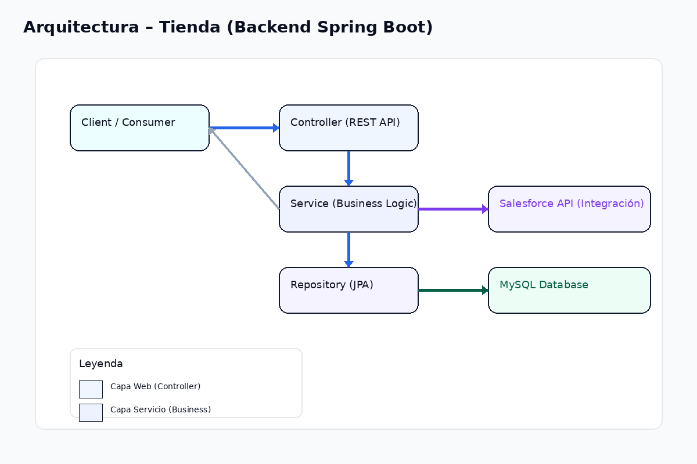
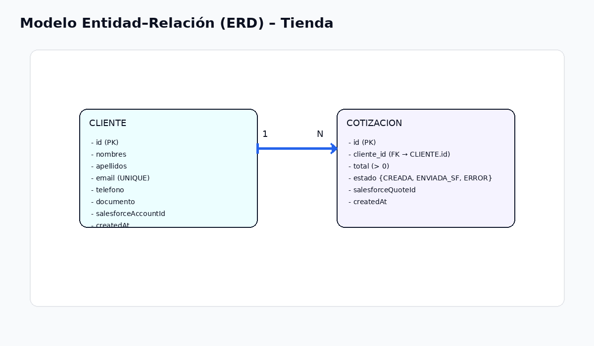

# 🛒 Tienda – Backend en Spring Boot

Aplicación **backend** desarrollada con **Spring Boot** para la gestión de una tienda: administración de **clientes** y **cotizaciones**, persistencia con **JPA**/**MySQL**, validaciones con **Bean Validation** y preparación para integración con **Salesforce**.

> Este README es la **versión completa y extendida** (estilo profesional) con ejemplos, DTOs, snippets OpenAPI, guía de ejecución, pruebas, calidad de código, **Docker** y CI.

---

## 🏷️ Badges


---

## 📘 Tabla de Contenidos

- [Tecnologías](#-tecnologías)
- [Arquitectura del proyecto](#-arquitectura-del-proyecto)
- [Arquitectura (alto nivel)](#-arquitectura-alto-nivel)
- [Modelo Entidad–Relación (ERD)](#-modelo-entidad–relación-erd)
- [Modelo de dominio](#-modelo-de-dominio)
- [Reglas de negocio implementadas](#-reglas-de-negocio-implementadas)
- [Persistencia / Base de datos](#-persistencia--base-de-datos)
- [API Endpoints](#-api-endpoints)
  - [Clientes](#-clientes)
    - [Crear cliente](#-crear-cliente)
    - [Obtener cliente por id](#-obtener-cliente-por-id)
  - [Cotizaciones](#-cotizaciones)
    - [Crear cotización](#-crear-cotización)
    - [Listar cotizaciones por cliente (paginado)](#-listar-cotizaciones-por-cliente-paginado)
- [DTOs (ejemplos)](#-dtos-ejemplos)
- [Manejo de errores (estándar)](#-manejo-de-errores-estándar)
- [Integración con Salesforce](#-integración-con-salesforce)
- [Configuración de entorno](#-configuración-de-entorno)
- [Cómo ejecutar (local)](#️-cómo-ejecutar-local)
- [🚢 Docker](#-docker)
  - [Estructura recomendada](#estructura-recomendada)
  - [Dockerfile](#dockerfile)
  - [docker-compose.yml (educativo sin contraseña)](#docker-composeyml-educativo-sin-contraseña)
  - [Inicialización automática con schema.sql](#inicialización-automática-con-schemasql)
  - [Comandos útiles](#comandos-útiles)
  - [Solución de problemas comunes](#solución-de-problemas-comunes)
- [Pruebas](#-pruebas)
- [Licencia](#-licencia)
- [Autor](#-autor)

---

## 🚀 Tecnologías

- **Java 21**
- **Spring Boot 3.x** (Web MVC)
- **Spring Data JPA**
- **Bean Validation (Jakarta Validation)**
- **MySQL**
- **Maven** (con **Maven Wrapper**)
- **Lombok**

> Versión de Java y Spring recomendadas para entornos modernos. Ajusta el `pom.xml` según tus necesidades.

---

## 🏗️ Arquitectura del proyecto

Arquitectura por capas con separación de responsabilidades:

```
src/main/java/com/tienda
 ├── config/                 # Configuración general (CORS, Jackson, etc.)
 ├── controller/             # Controladores REST (API)
 ├── dto/                    # Data Transfer Objects (requests/responses)
 ├── exception/              # Manejo global de errores (ControllerAdvice)
 ├── integration/
 │    └── salesforce/        # Adaptadores / clientes para Salesforce
 ├── model/                  # Entidades del dominio (JPA)
 ├── repository/             # Repositorios JPA
 └── service/                # Lógica de negocio y orquestación
```

## 🏗️ Arquitectura (alto nivel)


## 🗄️ Modelo Entidad–Relación (ERD)


---

## 🧩 Modelo de dominio

### 👤 Cliente
Representa un cliente de la tienda.

**Campos principales**
- `nombres`, `apellidos`
- `email` (único)
- `telefono`
- `documento`
- `salesforceAccountId`

**Relaciones**
- Un **cliente** puede tener múltiples **cotizaciones** (1:N).

---

### 🧾 Cotizacion
Representa una cotización asociada a un cliente.

**Campos principales**
- `cliente`
- `total` (mayor a 0)
- `estado`
- `salesforceQuoteId`

**Relaciones**
- Muchas **cotizaciones** pertenecen a un **cliente** (N:1).

---

### 🔖 EstadoCotizacion (Enum)
- `CREADA`
- `ENVIADA_SF`
- `ERROR`

---

## ✅ Reglas de negocio implementadas

- Un cliente debe tener nombres, apellidos y email válidos.
- El email del cliente es único.
- Una cotización debe estar asociada a un cliente.
- El total de la cotización debe ser mayor a 0.
- El estado inicial de la cotización es `CREADA`.
- Los campos `createdAt` se asignan automáticamente al persistir.

---

## 🗄️ Persistencia / Base de datos

- **Spring Data JPA** para acceso a datos.
- Tabla `cliente` con restricción única en `email`.
- Tabla `cotizacion` con FK `cliente_id` → `cliente.id`.

> Recomendado agregar migraciones con **Flyway** o **Liquibase** en futuro.

---

## 🔌 API Endpoints

Prefijo común: `/api`

> Host por defecto en ejemplos: `http://localhost:8080`

---

## 👤 Clientes

### ➕ Crear cliente

Crea un nuevo cliente aplicando validaciones y restricciones de unicidad.

**Endpoint**
- **POST** `/api/clientes`

**Request Body (`ClienteCreateRequest`)**
```json
{
  "nombres": "Juan",
  "apellidos": "Pérez",
  "email": "juan.perez@example.com",
  "telefono": "3001234567",
  "documento": "1234567890"
}
```

**Response Body (`ClienteResponse`)**
```json
{
  "id": 1,
  "nombres": "Juan",
  "apellidos": "Pérez",
  "email": "juan.perez@example.com",
  "telefono": "3001234567",
  "documento": "1234567890",
  "salesforceAccountId": null,
  "createdAt": "2026-02-12T15:30:20Z"
}
```

**Códigos de respuesta**
- `201 Created` → creado
- `400 Bad Request` → validación fallida
- `409 Conflict` → email duplicado (si aplica)

**Controlador (referencia)**
```java
@PostMapping
public ResponseEntity<ClienteResponse> crear(@Valid @RequestBody ClienteCreateRequest request) {
    ClienteResponse creado = clienteService.crearCliente(request);
    return ResponseEntity.status(HttpStatus.CREATED).body(creado);
}
```

---

### 🔎 Obtener cliente por id

**Endpoint**
- **GET** `/api/clientes/{id}`

**Códigos de respuesta**
- `200 OK` → encontrado
- `404 Not Found` → no existe

**Ejemplo (curl)**
```bash
curl "http://localhost:8080/api/clientes/1"
```

---

## 📄 Cotizaciones

### ➕ Crear cotización

Crea una nueva cotización asociada a un cliente existente.

**Endpoint**
- **POST** `/api/cotizaciones`

**Request Body (`CotizacionCreateRequest`)**
```json
{
  "clienteId": 1,
  "total": 259900.0,
  "comentarios": "Cotización inicial para cliente"
}
```

**Response Body (`CotizacionResponse`)**
```json
{
  "id": 42,
  "clienteId": 1,
  "total": 259900.0,
  "estado": "CREADA",
  "salesforceQuoteId": null,
  "createdAt": "2026-02-12T15:27:45Z"
}
```

**Códigos de respuesta**
- `201 Created` → creada
- `400 Bad Request` → validación fallida
- `404 Not Found` → cliente no encontrado

**Controlador (referencia)**
```java
@PostMapping
public ResponseEntity<CotizacionResponse> crear(@Valid @RequestBody CotizacionCreateRequest request) {
    CotizacionResponse creada = cotizacionService.crearCotizacion(request);
    return ResponseEntity.status(HttpStatus.CREATED).body(creada);
}
```

---

### 📚 Listar cotizaciones por cliente (paginado)

Devuelve cotizaciones del cliente en formato paginado. Por defecto `size=10` y `sort=createdAt,desc`. Si el `size` solicitado excede **50**, se limita a `50`.

**Endpoint**
- **GET** `/api/clientes/{id}/cotizaciones`

**Parámetros**
- **Path**: `id` *(Long, requerido)*
- **Query**:
  - `page` *(int, default `0`)*
  - `size` *(int, default `10`, máx `50`)*
  - `sort` *(string, default `createdAt,desc`)*

**Códigos de respuesta**
- `200 OK` → `PageResponse<CotizacionResponse>`
- `404 Not Found` → cliente no existe

**Controlador (referencia)**
```java
@GetMapping("/{id}/cotizaciones")
public ResponseEntity<PageResponse<CotizacionResponse>> listarCotizacionesPorCliente(
        @PathVariable Long id,
        @PageableDefault(size = 10, sort = "createdAt", direction = Sort.Direction.DESC) Pageable pageable
) {
    int maxSize = 50;
    if (pageable.getPageSize() > maxSize) {
        pageable = Pageable.ofSize(maxSize).withPage(pageable.getPageNumber());
    }
    return ResponseEntity.ok(cotizacionService.listarPorClientePaginado(id, pageable));
}
```

**Ejemplos (curl)**
```bash
curl "http://localhost:8080/api/clientes/1/cotizaciones"

curl "http://localhost:8080/api/clientes/1/cotizaciones?page=0&size=20&sort=total,asc"

# Pidiendo size=200 → el controlador limitará a 50
curl "http://localhost:8080/api/clientes/1/cotizaciones?page=0&size=200"
```

---

## 📦 DTOs (ejemplos)

> Ajusta si tus clases reales difieren.

### `ClienteCreateRequest`
```json
{
  "nombres": "Juan",
  "apellidos": "Pérez",
  "email": "juan.perez@example.com",
  "telefono": "3001234567",
  "documento": "1234567890"
}
```

### `ClienteResponse`
```json
{
  "id": 1,
  "nombres": "Juan",
  "apellidos": "Pérez",
  "email": "juan.perez@example.com",
  "telefono": "3001234567",
  "documento": "1234567890",
  "salesforceAccountId": null,
  "createdAt": "2026-02-12T15:30:20Z"
}
```

### `CotizacionCreateRequest`
```json
{
  "clienteId": 1,
  "total": 259900.0,
  "comentarios": "Cotización inicial para cliente"
}
```

### `CotizacionResponse`
```json
{
  "id": 42,
  "clienteId": 1,
  "total": 259900.0,
  "estado": "CREADA",
  "salesforceQuoteId": null,
  "createdAt": "2026-02-12T15:27:45Z"
}
```

### `PageResponse<CotizacionResponse>`
```json
{
  "content": [
    {
      "id": 42,
      "clienteId": 1,
      "total": 259900.0,
      "estado": "CREADA",
      "salesforceQuoteId": null,
      "createdAt": "2026-02-12T15:27:45Z"
    }
  ],
  "page": 0,
  "size": 10,
  "totalElements": 1,
  "totalPages": 1,
  "sort": [
    { "property": "createdAt", "direction": "DESC" }
  ]
}
```

---

## 🧱 Manejo de errores (estándar)

Si utilizas `@ControllerAdvice` para errores, documenta el formato de salida:

```json
{
  "timestamp": "2026-02-12T15:29:01Z",
  "status": 400,
  "error": "Bad Request",
  "message": "total must be greater than 0",
  "path": "/api/cotizaciones"
}
```

> Sugerencia: centralizar validaciones y mapear excepciones de dominio (p. ej., `ClienteNoExisteException → 404`).

---

## 🔗 Integración con Salesforce

- `Cliente.salesforceAccountId` → referencia a **Account**
- `Cotizacion.salesforceQuoteId` → referencia a **Quote**

Estados de sincronización: `CREADA`, `ENVIADA_SF`, `ERROR`.

> Las credenciales deben manejarse con variables de entorno o configuración externa. **No** subir secretos al repositorio.

---

## ⚙️ Configuración de entorno

Crea `src/main/resources/application.properties` (o `application.yml`):

```properties
spring.datasource.url=jdbc:mysql://localhost:3306/tienda
spring.datasource.username=TU_USUARIO
spring.datasource.password=TU_PASSWORD

spring.jpa.hibernate.ddl-auto=update
spring.jpa.show-sql=true
spring.jpa.open-in-view=false
```

> Recomendado: usar perfiles (`application-dev.properties`, `application-prod.properties`).

---

## ▶️ Cómo ejecutar (local)

```bash
git clone https://github.com/joasalazargi568/tienda.git
cd tienda
./mvnw spring-boot:run
```

Windows:
```bash
mvnw.cmd spring-boot:run
```

Aplicación por defecto: `http://localhost:8080`

---

## 🚢 Docker

### Estructura recomendada

```
./
├── docker/
│   └── init/
│       └── schema.sql        # Esquema SQL inicial (opcional)
├── Dockerfile                # Imagen multi-stage de la app
├── docker-compose.yml        # Orquestación app + MySQL
└── README.md
```

### Dockerfile

```Dockerfile
# ==== Etapa 1: Build ====
FROM maven:3.9-eclipse-temurin-21 AS build
WORKDIR /app
COPY pom.xml .
RUN mvn -q -DskipTests dependency:go-offline
COPY src ./src
RUN mvn -q -DskipTests clean package

# ==== Etapa 2: Runtime ====
FROM eclipse-temurin:21-jre
WORKDIR /app
COPY --from=build /app/target/*.jar app.jar
EXPOSE 8080
ENTRYPOINT ["java", "-jar", "app.jar"]
```

### docker-compose.yml (educativo sin contraseña)

```yaml
services:
  db:
    image: mysql:8
    container_name: tienda_db
    environment:
      MYSQL_ALLOW_EMPTY_PASSWORD: "yes"
      MYSQL_DATABASE: tienda
    ports:
      - "3307:3306"   # evita conflicto con MySQL local
    volumes:
      - ./docker/init:/docker-entrypoint-initdb.d
    healthcheck:
      test: ["CMD", "mysqladmin", "ping", "-h", "localhost"]
      interval: 10s
      retries: 10
      timeout: 5s

  app:
    build: .
    container_name: tienda_app
    ports:
      - "8080:8080"
    environment:
      SPRING_DATASOURCE_URL: jdbc:mysql://db:3306/tienda
      SPRING_DATASOURCE_USERNAME: root
      SPRING_DATASOURCE_PASSWORD: ""
    depends_on:
      db:
        condition: service_healthy
```

> Si prefieres un entorno **seguro con contraseña**, define `MYSQL_ROOT_PASSWORD`, `MYSQL_USER` y `MYSQL_PASSWORD`, y ajusta las variables de la app en consecuencia.

### Inicialización automática con schema.sql

Coloca tu **`schema.sql`** en `docker/init/`.
La imagen oficial de MySQL ejecutará cualquier `.sql` en `/docker-entrypoint-initdb.d/` **solo la primera vez** que la base se inicializa (si el volumen está vacío).

**Reseteo necesario para ejecutar el schema por primera vez:**
```bash
docker compose down -v
docker compose up -d --build
```


### Comandos útiles

> Lista práctica para el día a día con Docker y Docker Compose.

#### 📦 Imágenes
```bash
# Listar imágenes locales
docker images

# Construir imagen (si usas Dockerfile en la raíz)
docker build -t tienda:dev .

# Eliminar imagen (forzar si está en uso)
docker rmi tienda:dev --force
```

#### 🧱 Contenedores
```bash
# Listar contenedores en ejecución
docker ps

# Listar TODOS los contenedores (incluye parados)
docker ps -a

# Detener / iniciar / eliminar contenedor
docker stop tienda_app
docker start tienda_app
docker rm tienda_app

# Ver procesos dentro del contenedor (tipo "top")
docker top tienda_app

# Consumo de recursos en vivo
docker stats
```

#### 🔎 Logs y diagnóstico
```bash
# Ver logs en tiempo real (Compose)
docker compose logs -f app

# Ver últimos 100 logs del servicio de DB
docker compose logs --tail=100 db

# Inspeccionar metadatos de un contenedor (IP, mounts, etc.)
docker inspect tienda_app | less
```

#### 🧭 Ejecutar comandos dentro del contenedor
```bash
# Abrir una shell dentro de la app (si tiene /bin/sh)
docker exec -it tienda_app sh

# Ejecutar cliente mysql dentro del contenedor de DB
# (ajusta usuario/clave según tu configuración)
docker exec -it tienda_db mysql -uroot -e "SHOW DATABASES;"
```

#### 🗂️ Copiar archivos entre host y contenedor
```bash
# Copiar del host → contenedor
docker cp ./local.txt tienda_app:/app/local.txt

# Copiar del contenedor → host
docker cp tienda_app:/app/app.jar ./app.jar
```

#### 🧹 Limpieza (con cuidado)
```bash
# Eliminar contenedores parados, redes no usadas, imágenes dangling y cache de build
docker system prune -f

# Eliminar TODAS las imágenes no usadas (agresivo)
docker image prune -a -f

# Eliminar volúmenes no referenciados (¡borra datos!)
docker volume prune -f
```

#### 🌐 Redes y volúmenes
```bash
# Listar redes y volúmenes
docker network ls
docker volume ls

# Inspeccionar redes/volúmenes
docker network inspect <network>
docker volume inspect <volume>
```

#### 🧩 Docker Compose (lo más usado en este proyecto)
```bash
# Levantar (con build si cambiaste el Dockerfile)
docker compose up -d --build

# Ver estado general
docker compose ps

# Reiniciar solo la app
docker compose restart app

# Apagar todo
docker compose down

# Apagar y BORRAR volúmenes (reinicia DB)
docker compose down -v

# Reconstruir solo la app tras cambios
docker compose build app
```

### Solución de problemas comunes

- **Warning `version:` obsoleta en docker-compose** → quita la línea `version:`.
- **`ports are not available: 3306`** → cambia a `"3307:3306"` o detén MySQL local.
- **`Database is uninitialized and password option is not specified`** → usa `MYSQL_ALLOW_EMPTY_PASSWORD: "yes"` (educativo) o define `MYSQL_ROOT_PASSWORD`.
- **La app no conecta a MySQL** → revisa env de la app (`SPRING_DATASOURCE_*`) y que el host sea `db` y puerto `3306` interno.

---

## 🧪 Pruebas

```bash
./mvnw test
```

---

## 📄 Licencia

Este proyecto se distribuye bajo licencia **MIT**. Puedes usarlo libremente con atribución.

---

## 👤 Autor

**Johnatan Andres Salazar Giraldo**  
Backend Developer | Salesforce Developer  
📍 Medellín, Colombia
